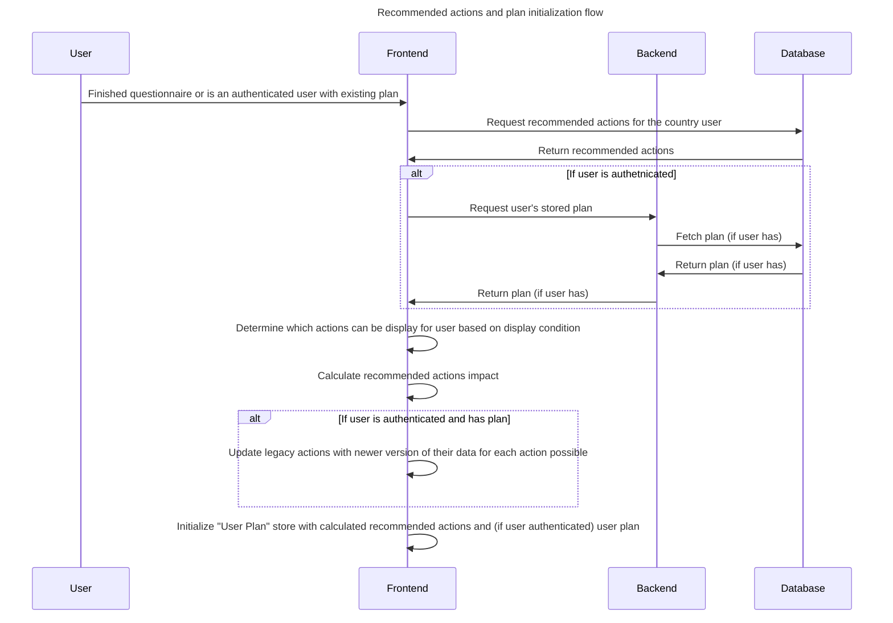
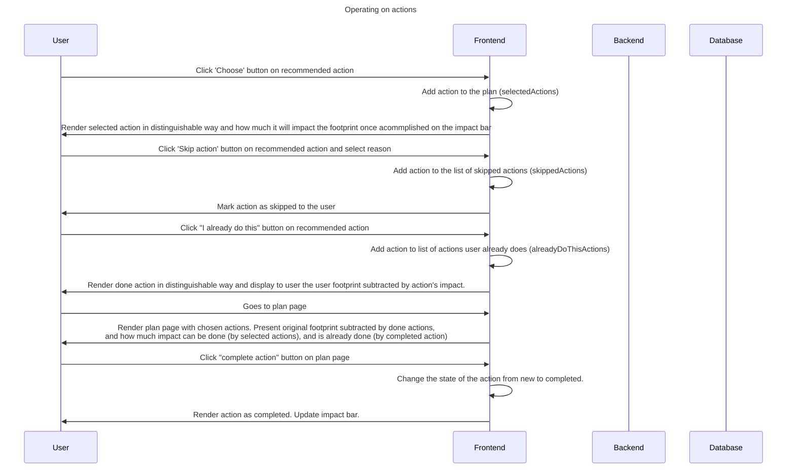
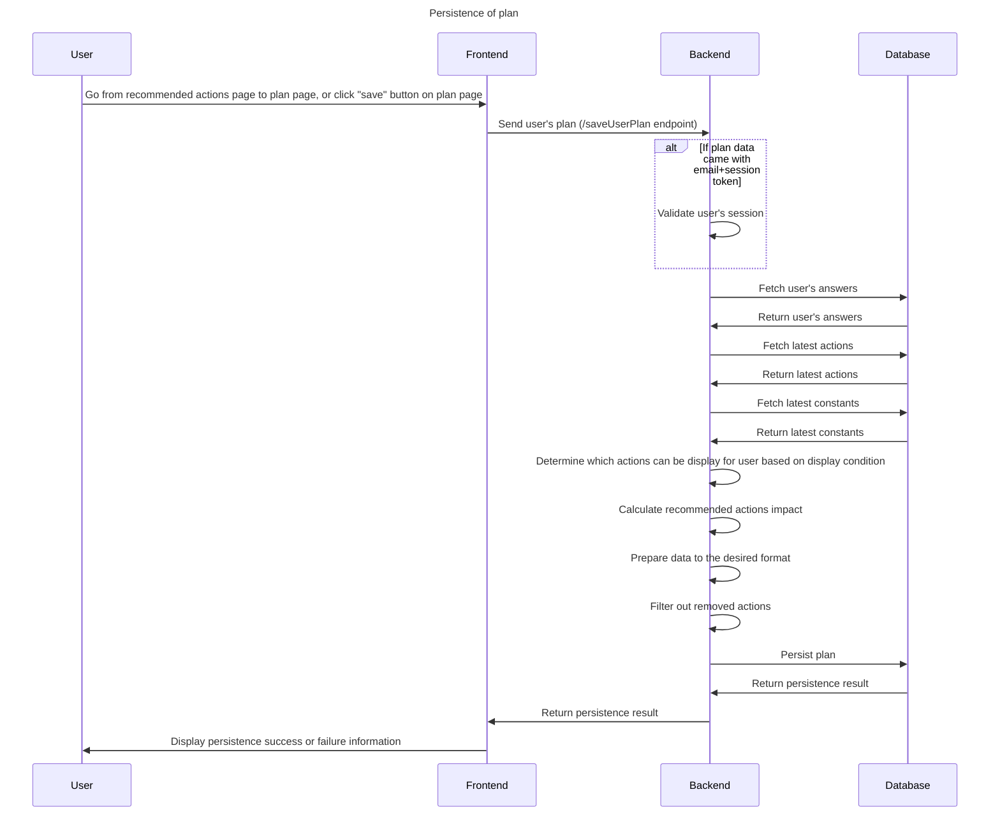

# Actions and Plan

## Overview

After questionnaire is filled by a users, they get an opportunity to select different footprint-reducing actions, which
are recommended to them based on answers selected in the questionnaire.

As a result, users can select any number of actions, creating their own actions plan. This plan can be later followed
by users (if user is authenticated), to see what actions were picked and how it impacts their plan of reducing carbon
footprint, as well as to track their progress.

## Actions management

Recommended actions are created and managed in Google Sheets, in country-specific sheet (name: `${countryCode}_ACT_2`).

More details can be found here:

- [actions](./google-sheets.md#actions)

After any changes are applied to these data, synchronization between GSheet and Firestore must be executed
using [GitHub Action](./google-sheets.md#data-synchronization-to-firestore)

## Actions to be displayed

Actions to be displayed to user are determined by "Display Condition" field in GSheet. It can include multiple
conditions, which when all of them are true, make an action to be visible to a user. Conditions can use constants
and [answer variables](./questionnaire.md#calculations).

Some of the actions can have also configured "skipIdsIfSelected" field. This field defines that if the action get
selected,
all other actions (from the list of IDs from that field) will get hidden from the user. This is made for the purpose of
avoiding contradicting actions, for example, to not display "Reduce flying", if user already selected action "Make your
holiday a staycation".

## Action impact calculation

Action impact is calculated using formula, which can use real values
and [answer variables](./questionnaire.md#calculations). There can be multiple formulas per action, and the one which
will be used is determined by the condition.
Formulas are managed in GSheet under `Impact formulas` column, and they have the following format:

`CONDITION1 ; ANOTHER_CONDITION2 | FORMULA1, CONDITION3 ; ANOTHER_CONDITION4 | FORMULA2`

For example:

```
QUESTION_A990DD6ACC6D039A_FOOTPRINT === -113 | 11.3 * ANSWER_FOO_HOW_MUCH
QUESTION_A990DD6ACC6D039A_FOOTPRINT === 51 | 31 * ANSWER_FOO_HOW_MUC, QUESTION_A990DD6ACC6D039A_FOOTPRINT === 449 | 71 * ANSWER_FOO_HOW_MUCH
QUESTION_A990DD6ACC6D039A_FOOTPRINT === 51 ; QUESTION_A990DD6ACC6D039A_FOOTPRINT === 55 | 31 * ANSWER_FOO_HOW_MUC, QUESTION_A990DD6ACC6D039A_FOOTPRINT === 449 | 71 * ANSWER_FOO_HOW_MUCH
```

Result of calculation is stored under `calculatedImpact` field, and then impact percentage is stored
under `percentReduction`field.

## Recommended actions

After filling a questionnaire, users are presented with list of recommended actions they can take to reduce their carbon
footprint. List of actions is determined [display condition](#actions-to-be-displayed).

Users can perform 3 actions with recommended actions:

### Choose it

This will add chosen action to the actions plan, increasing potential impact of how much footprint it can reduce.

### Skip action

Indicates to user that they decided to skip it

### I already do this

Action will not get visible on to the plan page, but is part of user's plan and it will reduce the user's footprint
which was determined based on questionnaire.

## Plan page

After actions are added to the plan, users can track progress of fulfilling these actions, and see how it impacts their
footprint.

When user finished the action, they can "complete" the action by clicking button, which would result in their footprint
impact bar to grow.

It is possible that user has answers selected in the past, for which formulas or other values differ comparing to the
time when they were added to the plan. In such case, data of actions will be updated on frontend (when loading
recommended actions + stored plan) and then persisted this way to the backend, if there is only newer version of action
(that's why action version is stored on per-action basis rather than in metadata).

## Plan persistence

After the recommended actions page, as well as after clicking "save" button on plan page, the plan actions are sent to
backend. It will firstly ensure that actions from plan are updated with the newest data (formulas, other values), and
then
recalculated and stored to the database.

We store plan set in the following format:

- **metadata**
  - **campaignIds**: list of campaign IDs to which the plan belongs to
  - **createdAt**: datetime of when the answer set was created "2023-11-13T11:06:48.250Z"
- **alreadyDoThisActions**: object with calculated actions, which impact is used to reduce final user's footprint.
- **selectedActions**: object with calculated action.
- **skippedActions**: List of skipped action IDs and reason of why they got skipped. Those actions will not be displayed
  to the user ever again

Example of stored plan selected action:

```json
{
  "actionsVersion": "2023-12-05T08:48:48.163Z",
  "calculatedImpact": 585,
  "category": "transport",
  "id": "AD371A08E7828613",
  "percentReduction": 8.234670267988713,
  "skipIdsIfSelected": [
    "71F460AE8D12D785",
    "95FAEDCF34BD58DE",
    "7AD662D5EB0F1D78",
    "9F2C4EE4D175D4C5"
  ],
  "state": "new",
  "tags": ["savemoney", "savetime", "community", "saveenergy", "newexperience"],
  "title": "Use bioethanol in your car",
  "type": "Action"
}
```

## Sequence diagram of the flow

### Recommended actions and plan initialization flow



### Operating on actions



### Persistence of plan


