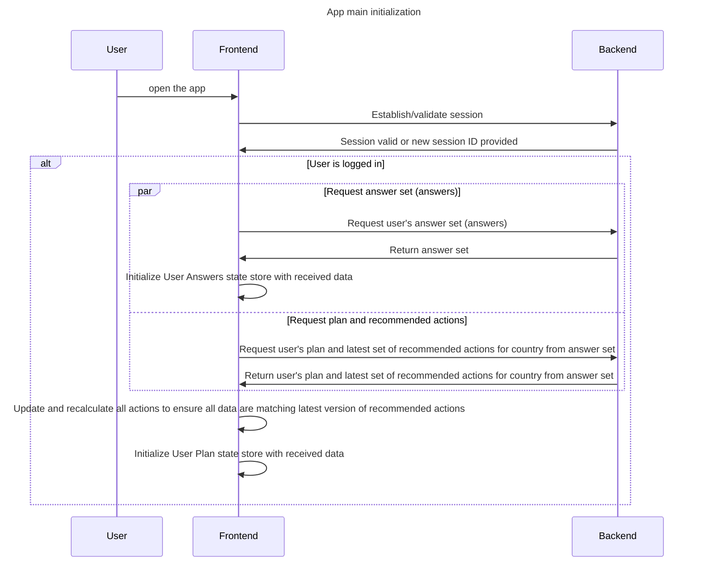

# App data initiation

## App main initialization

When the application is opened, [InitializationWrapper](../../enduser-ui/src/InitializationWrapper.tsx) component is
triggered. Its job is to pull all data needed by the entire application.

First of all, it ensures that [user session is established](./users-and-sessions.md#session-initialization).

Then, **if user is authenticated**, it will try to pull user's answers and plan, as well as recommended actions based on persisted answers.

## Questionnaire

When questionnaire is opened, both questions and constants are fetched on-demand, for the country selected by the user.
Always latest version of them is fetched.
