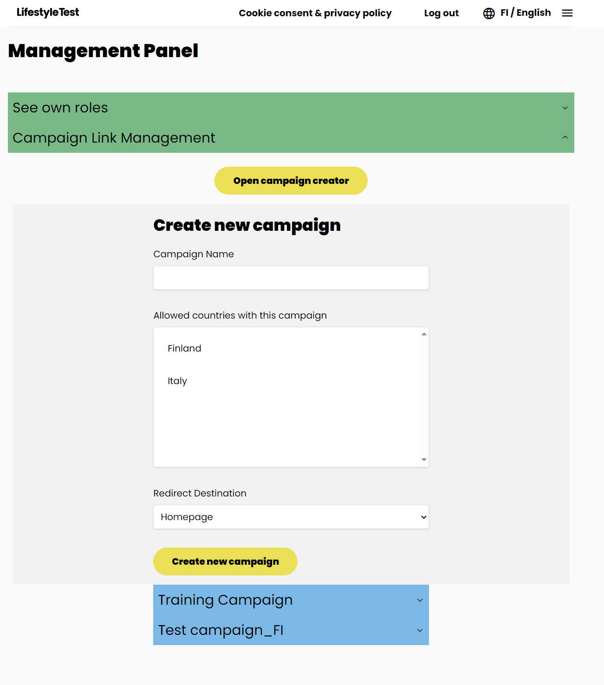
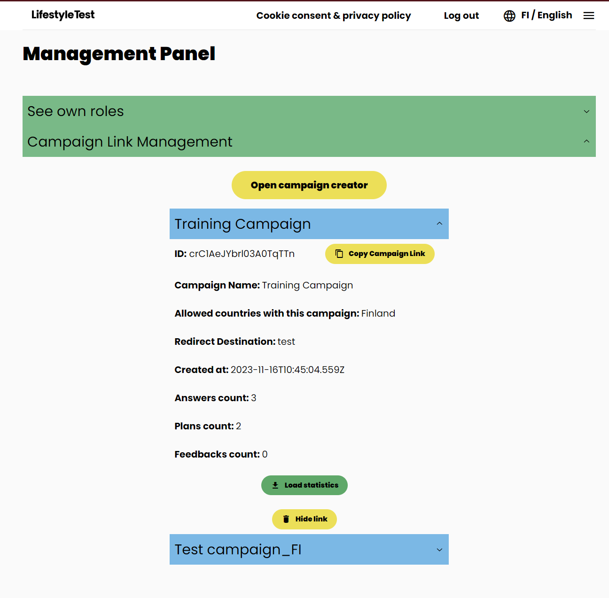

# Campaign

## Overview

The purpose of campaigns is the possibility to generate URLs including custom ID, which will allows to connect data
created by users (answers, plans, feedback) to specific actions organized by PSL partners and promoters.

It also allows to restrict list of countries, which can be selected by the user after visiting the application from
campaign link (or even preset the country if only one is configured for the campaign), as well as redirect user to the
test page, if needed (for example, if the campaign link is already located on landing page of partner organization).

To be able to manage campaigns, "CAMPAIGN_MANAGER" [role](./users-and-sessions.md#campaign-manager-role) is needed on
the authenticated user level.

## Campaign creation

Creation of new campaign is a matter of filling simple form with the following fields:

| Field name                           | Description                                                                                                                                                                                                                                                                                                                                                                                                                                                                           |
| ------------------------------------ | ------------------------------------------------------------------------------------------------------------------------------------------------------------------------------------------------------------------------------------------------------------------------------------------------------------------------------------------------------------------------------------------------------------------------------------------------------------------------------------- |
| Campaign name                        | Name of the campaign, which will help to identify the campaign when requesting statistics.                                                                                                                                                                                                                                                                                                                                                                                            |
| Allowed countries with this campaign | List of countries, which can be used by the user the application is opened using this campaign link. If only single country is assigned to the campaign, the country will be set automatically, without displaying country/language selection.                                                                                                                                                                                                                                        |
| Redirect Destination                 | **This setting will work only if single allowed country get selected.** When users open the application using the campaign link, by default they will be redirected to the homepage. However, sometimes the campaign link might be placed on landing page of partner, making it unnecessary to show the landing page of the application. In such case, it is possible to select "Test" value, which will ensure users will get redirected directly to tthe test (questionnaire) page. |

Once the "Create new campaign" gets clicked, new campaign gets persisted to the database (`campaigns` collection) with
the following structure:

```json
{
  "name": "Test campaign",
  "allowedCountries": ["IT"],
  "isHidden": false,
  "redirectDestination": "homepage"
}
```

The ID of campaign document is a randomly-generated string, which is generated automatically by Firestore SDK.



## Management actions on existing campaign

After the campaign is created, it gets visible below the creation form (click blue title bar to open campaign details).

At this point, manager can click "Copy Campaign Link", to copy the link to the clipboard.
Example link: `https://app-address.net?campaign=crC1AeJYbrl03A0TqTTn`

It is also possible to track real-time statistics, by clicking "Load statistics" at the bottom of the campaign details.
It will result in created answers count, plans count and feedbacks count for the campaign appear at the bottom of
details.

If the manager considers that the campaign doesn't need to be tracked anymore, "Hide link" button can be clicked, which
will simply hide the campaign from the view. **It is important to notice that it will not delete/deactivate the campaign
**,
so if any user is already assigned to that campaign and creates new data, those data will be also assigned to that campaign
(as well as to all other campaigns the user visited).



## Campaign URL usage

Once the user opens campaign URL, gets redirected to the PSL app. We try to establish
the [session](./users-and-sessions.md#session-initialization):

- For authenticated user, we verify email+session token and assign the campaign ID to user's entity directly, same as to
  latest answers, plan and feedback.
- For not authenticated users, we create/verify anonymous session, and then assign the campaign ID to their anonymous
  session, and assign to latest answers, plan and feedback

If user decides to log-in/ascend, the campaign IDs from anonymous user will be copied to the authenticated user entity.

When user creates another answers/plan/feedback, all campaign IDs from the user entity are also added to these entities.

Visualization of that can be found:

- [session initialization](./users-and-sessions.md#session-initialization)
- [copying campaign IDs from anonymous user to authenticated user entity](./users-and-sessions.md#login-process)
