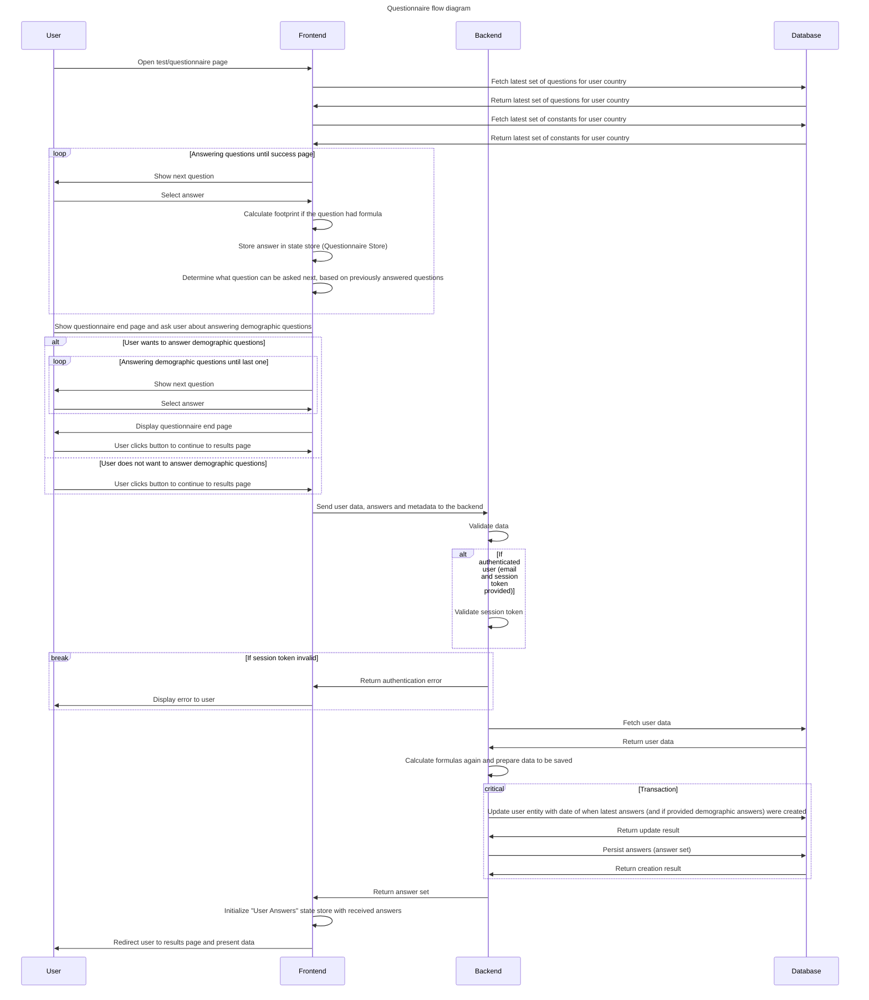

# Questionnaire

## Overview

The main functionality of the application is a questionnaire, where users can answer set of simple questions about their
daily habits and routines, based on which we determine carbon footprint generated by the person. After the
questionnaire,
users can see how different answers and categories of questions

## Questions and constants management

Questions are created and managed in Google Sheets, in country-specific sheet (country code is used as a sheet name).

Constants are also created in Google Sheets, in single "Constants" sheet, where country-specific numbers are defined
per column.

More details can be found here:

- [questions](./google-sheets.md#questions)
- [constants](./google-sheets.md#constants)

After any changes are applied to these data, synchronization between GSheet and Firestore must be executed
using [GitHub Action](./google-sheets.md#data-synchronization-to-firestore)

## Filling questionnaire

Users can start questionnaire by:

- Clicking "Start" button at the homepage
- Navigating to "Test" page in hamburger menu
- Entering the application using campaign URL assigned to single country, with configured "test" page as redirect
  destination

Users faces set of questions grouped into 4 categories:

- housing
- travel
- food
- purchases

Each of them has own color assigned, and the footprint is then also aggregated per category.

User can select only one answer out of several choices for each question, and those answers can determine what other
questions will we displayed later.

User has the possibility to go back and forth as long as the questionnaire is not submitted. However, if any question
answer will get modified, all answers for questions after that one will get removed, and user will need to answer them
again. This limitation is done due to the fact that some questions appear only if specific answer is selected in
previous question.

Whenever question is answered, [footprint calculation](#calculations) will be performed and current categorized
footprint will be
presented to the user.

After answering all the "ordinary" questions (one which can affect carbon footprint), user gets an option to also
answer a couple of demographic questions, which can be used later for analytical purposes.
These demographic answers will NOT be visible to the user after questionnaire is done.
Answering demographic questions is not mandatory, and the questionnaire can be finished before and after answering them.

## Persisting answers

### Frontend

Whenever user finishes the questionnaire, the data is sent to the backend (Firebase Function), `/saveUserAnswers`
endpoint with user information (either anonymous session ID or email+session token) and answers (otherwise called
**answer set**), which consists of:

- **answers:** List of questions and answers for them. Both ordinary and demographic answers are combined here, and then
  separated on the backend
- **metadata:** version of questions and constants used for the questionnaire as well as country used to fill the
  questionnaire

### Backend

**If the request is done for authenticated user** (email+session token is sent), the endpoint will firstly verify the
session token to ensure it's valid and not expired.

Then, the user entity will be fetched from database, and [answers calculated](#calculations) and prepared to the format
ready to save. One very important part of data preparation is to prepare list of variables exposed by the answer.

When data are validated and ready to be saved, transaction is opened to update the user entity first,
with `latestAnswerAt` and `latestDemographicAt` fields, which indicates when last answers were given by the user, and
then answer set is created.

Answers are saved under "answers" collection, which is nested under user entity in the Firestore, and the answer set
document ID is a timestamp of when the answer set was created.

We store answer set in the following format:

- **categorizedFootprint**: object with calculated footprint, grouped per category
- **metadata**
  - **campaignIds**: list of campaign IDs to which the answer belongs to
  - **constantsVersion**: version of constants used during questionnaire
  - **countryCode**: country code of country used when filling the questionnaire
  - **createdAt**: datetime of when the answer set was created
  - **questionnaireVersion**: version of questions used during questionnaire
    "2023-11-13T11:06:48.250Z"
- **ordinaryAnswers**: List of all answers which might affect user's footprint (coming from mandatory part of the
  questionnaire)
- **demographicAnswers**: List of answers belonging to the demographic questions (optional)

After data are persisted, answer set is returned to the frontend, for the purpose of presenting result page.

## Using stored answers

After the persisted answer set comes back from the backend, it gets passed to UserAnswers Store, and user is redirected
to results page, where they can see their total footprint as well as the one per category, and how they perform
comparing to average citizen of their country. Users also get possibility to share the results to their friends.

Answers also
affect [what recommended actions will be displayed to the user](./actions-and-plan.md#actions-to-be-displayed) and can
be part of [action impact calculation formula](./actions-and-plan.md#action-impact-calculation)

## Calculations

When answers are calculated, we iterate through all answers of user and check whether real value and variable (coming
from scope) is assigned to `choiceValue` and `relatedVariableValue`. If these contain variable, they will be mapped to
real value. When we have real values, they will be assigned in following manner:

- `choiceValue` => `variableName`
- `relatedVariableValue` => `relatedVariableName`

and added to the `variables` field, which is an object containing variables and their values assigned to their names.

At this point, if the question/answer has formula defined under `Math.js formula` (`formula` field inside entity), it
will be used to calculate actual footprint of the question. The formula can again include real values and variables
(which come from scope). The result of footprint calculation will be stored under separated
variable: `"QUESTION_" + ID + "_FOOTPRINT"` and `footprint` field. If answer has no formula, default value is 0.

Each answer has only access to variables defined by answers answered before that one.

**Scope** is a map of variables available for formula calculation and display conditions. It consists of **constants**
and variables stored under answers.

Example structure of calculated answer:

```json
{
  "category": "transport",
  "choiceText": "Petrol",
  "footprint": 0,
  "label": "car",
  "questionId": "86BF63FF5398E835",
  "questionText": "What does your car run on?",
  "sortKey": "02-02",
  "variables": {
    "ANSWER_TRA_FUEL_TYPE": 0.165,
    "QUESTION_86BF63FF5398E835_FOOTPRINT": 0,
    "TRA_CAR_AND_INFRA": 0.06
  }
}
```

## Sequence diagram of the flow


