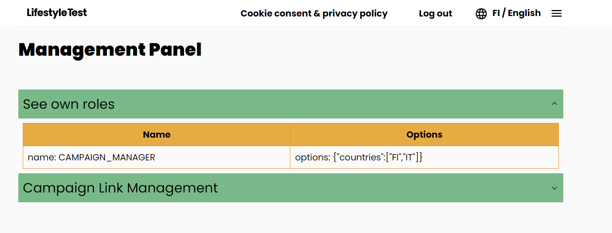

# Users and sessions

## Overview

The application distinguishes 2 types of users:

- Anonymous users
- Authenticated users

Both of those types can use the core functionality of the application, which is to fill the questionnaire, create
the plan and give feedback.

The benefit of becoming an authenticated user is that the answers and plan are stored permanently, unless user decides
to delete its account (such action deletes all user data), as well as more personalized experience provided to the user.

Authenticated users also can receive special roles, which allow them to access the "Management Panel", where they can
perform further actions (defined based on the roles they own).

However, from the data model point of view, those types are separated entities, stored in separated collections.

## Anonymous users

When user opens the app and is not logged in already, it's considered as an anonymous user.

Their data are stored under `anonymousUsers` collection, where the ID is randomly generated UUID v4.

They are allowed to interact with the application the same way as authenticated users,
with exception that they will not be able to access data they generated (answered questionnaire, action plan)
once they close their browser tab with the application, as their data is stored only
in [session storage](https://developer.mozilla.org/en-US/docs/Web/API/Window/sessionStorage) of the browser.

Anonymous users also have their "anonymous session ID" stored under "anonId" field in Anon Session state store,
which is then persisted to "anonSession" session storage field.

After anonymous user fills the questionnaire and creates action plan, they get an opportunity to get upgraded (
ascended),
what means they can create an account (using their email address) and connect the data they already created with that
newly created account. This way, they will be able to access their results and action plan whenever when they come back
to the application and login to their account.

## Authenticated users

When user is logged in (has email + session token
stored `auth` [local storage](https://developer.mozilla.org/en-US/docs/Web/API/Window/localStorage),
which can be then used by Authed Session state store), it is considered as an authenticated user.

Their data are stored under `users` collection, where the ID is a hashed email address of the user.

Authenticated users have their data stored in the session storage the same way as anonymous users, allowing the
application to behave the same way for both types of users. However, in case of authenticated users
the data generated is also fetched from the database (if email + session token are valid) when the
application is loaded and fed to the same state stores, for the purpose of presenting to users their data
whenever they want to access them.

Authenticated users also have a possibility to delete their account, which will result in their user data,
as well as the other data they generated, to be immediately removed from the system.

The login happens using magic link mechanism. More about it [below](#login-process)

## Session initialization

The purpose of session initiation is to generate unique ID, which allows us to store all data generated by single user
together, as well as assign them to the [campaigns](./campaign.md) user decided to participate (to open campaign link).

### Anonymous user

#### Establishing new anonymous session ID

If user doesn't have established anonymous session, new one will be established by sending request to the
backend, `/initializeUser` endpoint.

If there was a problem during initialization of the session, the application still should work, and the requests to
generate the session ID should be sent later, at the moment when it will be actually needed (for example, after
finishing the questionnaire).

If initialization was successful, received anon session ID will be stored to the "anonId" field of Anon Session
state store by the frontend app, and it will continue with [country/redirect handling](#country--redirect-handling).


#### Using existing anonymous session ID

If user already has `anonId` in `anonSession` session storage which is managed by Anon Session state store,
it will be sent to the `/initializeUser` endpoint, which will verify whether such session exists.

If there was a problem during initialization of the session, the application still should work, and the requests to
validate/generate the session ID should be sent later, at the moment when it will be actually needed (for example, after
finishing the questionnaire).

If the session by the ID will not be found, new session ID will be returned and `downgrade` flag returned. Frontend
in that case will assign new session ID, and it will continue
with [country/redirect handling](#country--redirect-handling).

If session by the ID was found, it will immediately continue with and it will continue
with [country/redirect handling](#country--redirect-handling).

If session exists, [successful flow](#successful-response-from-initializeuser) will be followed.


### Authenticated user

If user is authenticated (`user` is set inside `auth` local storage), request is sent to `/initializeUser` endpoint with
user's email and session token, to check if those are valid.

In case of failure of processing the request (for example, due to timeout or DB failure), user will NOT be logged out or
forbidden from using the app. All endpoints used for the interaction with user-specific data implement the session
token validation, and if it's not valid/it's expired, such actions will be blocked and user logged out at that point.

If the token is not valid or expired, the endpoint will generate new anonymous session ID and return `downgrade` flag.
In such case, frontend app will log out user automatically, and then assign received new anonymous session ID and
continue
with [country/redirect handling](#country--redirect-handling).

If token is valid, frontend app will immediately continue with [country/redirect handling](#country--redirect-handling).


### Country / redirect handling

After the response comes from `/initializeUser` and frontend handles the session-related stuff of the response
(downgrade, setting session ID, etc.), the shared part is to handle received available countries list and redirect
destination.

These fields are affected based on one or more [campaigns](./campaign.md) assigned to the user's session.

#### Allowed Countries

List of allowed countries returned by the endpoint will be set to the "allowedCountries" field of Location Store.

If list of allowed countries is empty, user will be able to use any country supported by the application and will be
presented country+language selection.

The same applies if list of allowed countries contains multiple country codes, but then user will be able to selected
only one of allowed countries.

If the list of allowed countries includes only **one** country code, that country and its default language will
be automatically set to the Location Store, without displaying country+language selection to the user.

#### Redirect destination

The response also includes redirect destination, defining where user should get redirected to after the
session initialization.

By default, (whether there is campaign or not), the value will be set to "homepage", which means that user will be
redirected to the homepage.

However, if any campaign is configured to value "test", then this setting takes over and user will be redirected
directly to the questionnaire.

**_However, this is only applicable if user is on homepage, to prevent user losing progress on page refresh_**

## Login process

The login process is done using so-called "magic link" mechanism, which utilizes token in the URL, which URL is sent to
the user via email message.

When user wants to log in, they go to login page where they provide their email address, which is then stored in
"magicLinkEmail" field of Authed Session state store (which then persists it under "auth" field of local storage).

Then, request is sent to the backend (`/requestLink` endpoint), which will either create new user entity
(if there is no entity for received email address), or it fetches the existing one, and then assigns following data
to that user entity:

- anonymous session ID has assigned while trying to log in
- Pseudorandom magic token
- Date of token generation
- Setting flag "linkUsed" to false

and sends the URL including generated magic link via email to the user.

When user clicks the received link, it gets redirected to `/checklogin` page, including the magic token.

At that moment, the email stored in `magicLinkEmail` field is combined with received magic link token, and sent to the
`/checkLink` endpoint. If the `magicLinkEmail` value is empty, or backend will not be able to resolve that combination,
or token is expired, frontend will inform user about that and ask to provide the email address which they used to log
in.

If the email address and magic link token match, several steps will be done happening:

1. Magic link gets used - `linkUsed` flag gets set to true
2. If user came from [user ascending](#user-ascending-upgrade-from-anonymous-to-authenticated-user), the data will
   get assigned to the authenticated user
3. If user still has the old data model (pre-december 2024), the data will get upgraded to version 1.

The endpoint also will verify whether user has answered questionnaire and created the plan.

As a response, the endpoint will return session token and information where user should get redirected to after login:

- Result page - When user has answered questionnaire, but not created plan
- Plan page - When user has both answered questionnaire and created the plan
- Test page - When no answers and plan were created


## User ascending (upgrade from anonymous to authenticated user)

Once anonymous users answers the questionnaire and creates the action plan, they get an opportunity to provide their
email address, which will initiate the "ascending process". It works almost the same as
the [login process](#login-process).

The difference is that in this case request to `/requestLink` endpoint does not only include anonymous session ID and
provided email address, but also "ascend" object field, which includes both answers and plan data.

Answers and plan are then persisted to the `unauthenticatedUsers` Firestore collection, with hashed email address
provided by the user as an ID of the entity.

Then, when `/checkLink` endpoint is called, and it will authenticate the user, those data will be moved to the
actual user entity under `users` collection.

For the visual flow, follow diagrams from [login process](#login-process).

## Roles

An authenticated user might be assigned to one of roles, which extends the functionality of the app, providing more
features as well as enables basic management. New "Management Panel" page gets enabled for those users.




### Campaign manager role

Campaign manager role enables users to create and see statistics for [campaign](campaign.md) links they create.

This role has the following options:

- countries: list of country codes for which campaigns can be created/seen.

Role structure under the user:

```json
{
  "name": "CAMPAIGN_MANAGER",
  "options": {
    "countries": ["FI", "DE", "TR"]
  }
}
```
