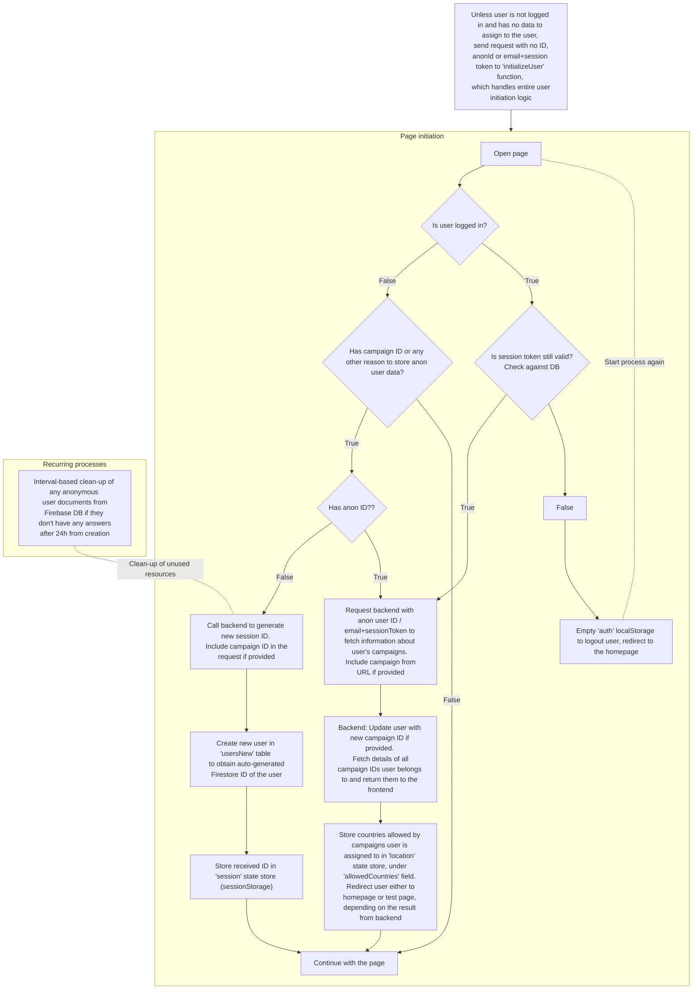

```mermaid
flowchart TD
    P0[Unless user is not logged in and has no data to assign to the user, \n send request with no ID, anonId or email+session token to 'initializeUser' function, \n which handles entire user initiation logic]-->pageInitiation
    subgraph pageInitiation [Page initiation]
        PI1[Open page]
        PI1-->PI2{Is user logged in?}
        PI2--False-->PI2F1{Has campaign ID or any other reason to store anon user data?}
        PI2F1--True-->PI2T1{Has anon ID??}
        PI2T1--False-->PI2T2["Call backend to generate new session ID. \n Include campaign ID in the request if provided"]
        PI2T2-->PI2T3[Create new user in 'usersNew' table \n to obtain auto-generated Firestore ID of the user]
        PI2T3-->PI2T4["Store received ID in 'session' state store (sessionStorage)"]
        PI2--True-->PI2T{Is session token still valid?\nCheck against DB}
        PI2T--True-->PI3

        PI2T-->False-->PI2F[Empty 'auth' localStorage to logout user, redirect to the homepage]
        PI2F-.Start process again.-PI1
        PI2T1--True-->PI3
        PI3["Request backend with anon user ID / email+sessionToken to fetch information about user's campaigns. \n Include campaign from URL if provided"]
        PI3-->PI4[Backend: Update user with new campaign ID if provided. \n Fetch details of all campaign IDs user belongs to and return them to the frontend]
        PI4-->PI5[Store countries allowed by campaigns user is assigned to in 'location' state store, under 'allowedCountries' field. \n Redirect user either to homepage or test page, depending on the result from backend]
        PI2F1--False-->PI6
        PI2T4-->PI6
        PI5-->PI6[Continue with the page]
    end

    subgraph recurringProcesses [Recurring processes]
        RP1[Interval-based clean-up of any anonymous \n user documents from Firebase DB if they \n don't have any answers after 24h from creation]
        RP1-.Clean-up of unused resources.-PI2T2
    end
```
