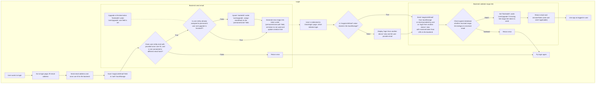

```mermaid
flowchart TD
    subgraph login [Login]
        L1[User wants to login]
        L1-->L2[Go to login page, fill email address]
        L2-->L3[Send email address and anon use ID to the backend]
        L3-->L4[Save 'magicLinkEmail' field to 'auth' localStorage]
        L4-->L5

        subgraph backendSendEmail [Backend send email]
            L5{Does user entity exist with provided anon user ID, and is not connected to different email hash?}
            L5--False-->L5F[Return error]
            L6Note[Upgrade is finished when \n 'finishedAt' under 'userUpgrade' user field is set] -..- L6
            L5--True-->L6{Is user entity already assigned to permanent user and upgrade is finished??}
            L6--False-->L6F[Upsert 'startedAt' under 'userUpgrade', assign emailHash to the 'permanentUser' field.]
            L6F-->L7
            L6--True-->L7[Generate new magic link token under 'permanentUser.auth' field, \n set token to not used and update creation time]
        end
        L8[User receives email and clicks link]
        L7-.->L8[User is redirected to 'checklogin' page, which initiates login]
        L8-->L9{Is 'magicLinkEmail' value stored in the localStorage?}
        L9--False-->L9F1[Display 'login from another device' view and let user provide email]
        L9--True-->L10
        L9F1-->L10[Send 'magicLinkEmail' from localStorage \n or email provided by user on 'login from another device' view \n with received token from URL to the backend]


        subgraph backendValidateMagicLink [Backend validate magic link]
        L10-->L11{Check against database whether received magic link belogns to received email}
        L11--NoMatch-->L11F[Return error]
        L11--Match-->L12["Set 'finishedAt' under 'userUpgrade' if missing". Set magic link token to used.]
        L12-->L13["Return email and sessionToken (and user role if applicable)"]
        end

        L5F-->L16
        L11F-->L16[Try login again]
        L13-->L14[Use app as logged in user]
    end
```
