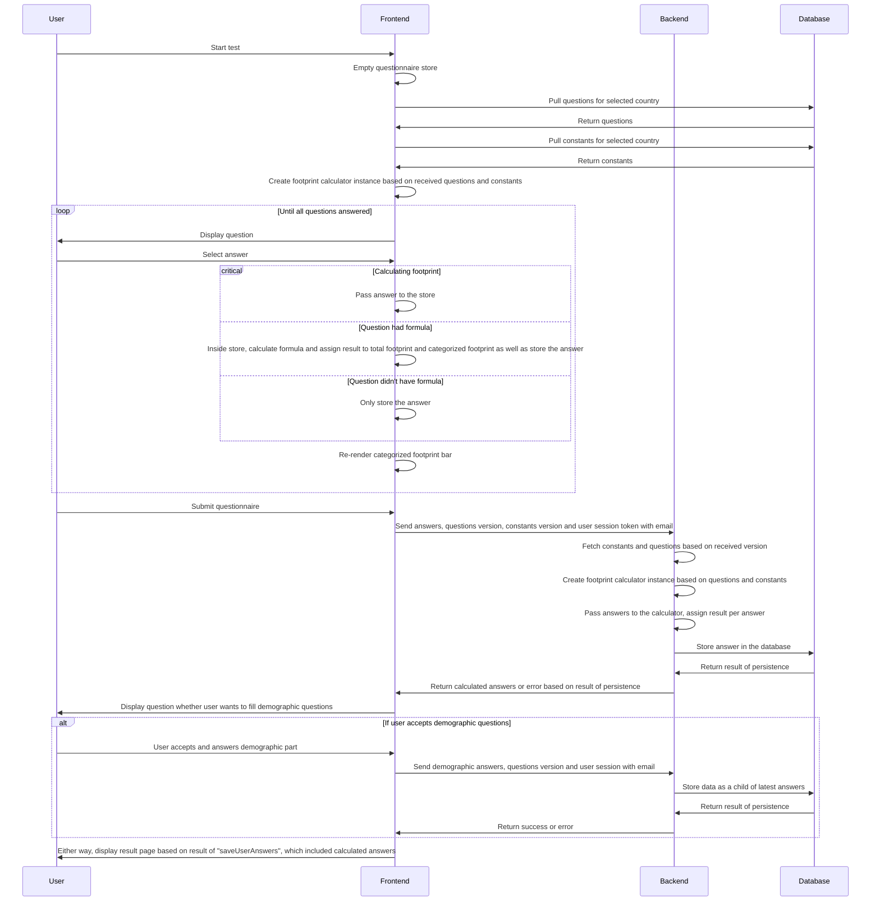

```mermaid
sequenceDiagram
    participant User
    participant Frontend
    participant Backend
    participant Database

    User->>Frontend: Start test
    Frontend->>Frontend: Empty questionnaire store
    Frontend->>Database: Pull questions for selected country
    Database->>Frontend: Return questions
    Frontend->>Database: Pull constants for selected country
    Database->>Frontend: Return constants
    Frontend->>Frontend: Create footprint calculator instance based on received questions and constants
    loop Until all questions answered
        Frontend->>User: Display question
        User->>Frontend: Select answer
        critical Calculating footprint
            Frontend->>Frontend: Pass answer to the store
            option Question had formula
                Frontend->>Frontend: Inside store, calculate formula and assign result to total footprint and categorized footprint as well as store the answer
            option Question didn't have formula
                Frontend->>Frontend: Only store the answer
        end
        Frontend->>Frontend: Re-render categorized footprint bar
    end
    User->>Frontend: Submit questionnaire
    Frontend->>Backend: Send answers, questions version, constants version and user session token with email
    Backend->>Backend: Fetch constants and questions based on received version
    Backend->>Backend: Create footprint calculator instance based on questions and constants
    Backend->>Backend: Pass answers to the calculator, assign result per answer
    Backend->>Database: Store answer in the database
    Database->>Backend: Return result of persistence
    Backend->>Frontend: Return calculated answers or error based on result of persistence
    Frontend->>User: Display question whether user wants to fill demographic questions
    alt If user accepts demographic questions
        User->>Frontend: User accepts and answers demographic part
        Frontend->>Backend: Send demographic answers, questions version and user session with email
        Backend->>Database: Store data as a child of latest answers
        Database->>Backend: Return result of persistence
        Backend->>Frontend: Return success or error
    end
    Frontend->>User: Either way, display result page based on result of "saveUserAnswers", which included calculated answers
```
